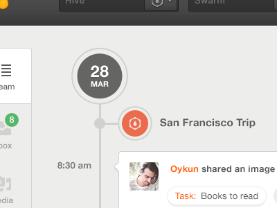

Elias
=====

Elias is a place where you quickly share ideas, random bits discovered on the Internet (or books) etc., and have discussions with your friends.

The discussion and informations iteself could then be saved to personal knowledge database for later use.

It's more like social version of Evernote, or a more private and flexiable version of Goolge+.

It will support publising notes to github pages. In ways of blog and wiki.

## Use cases

## Design

1. timeline
https://mixpanel.com/about/

2. theming (from dribble)
  

3. Free bootstrap themes
http://bootswatch.com/

4. Free web fonts
http://www.google.com/fonts/#
